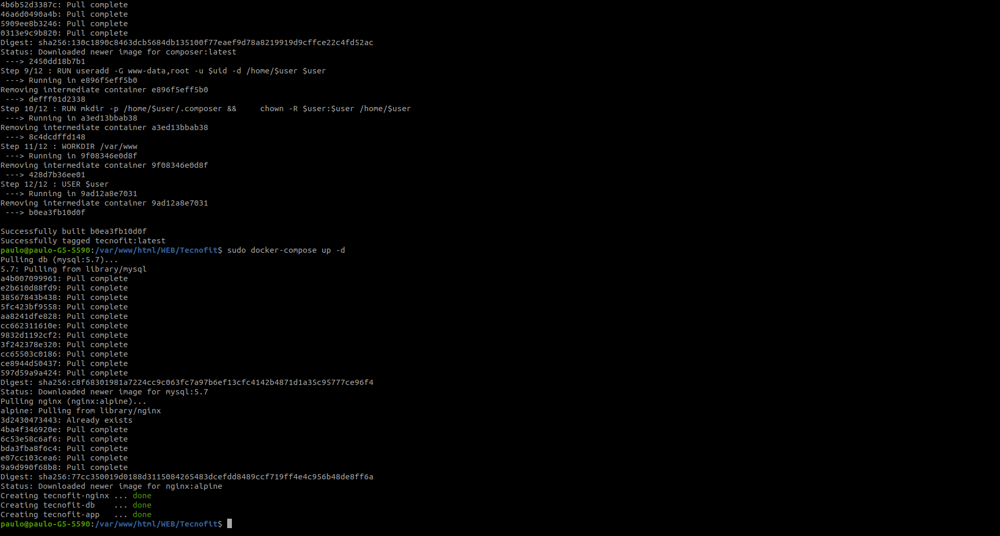
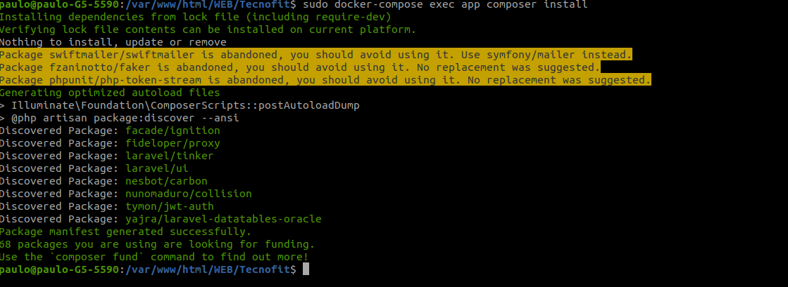
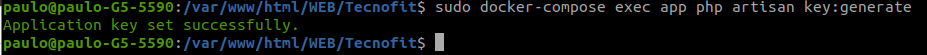
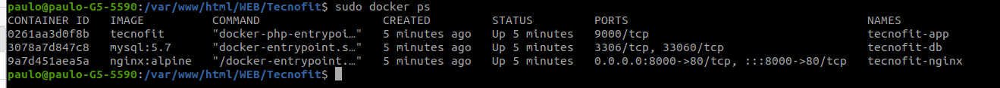
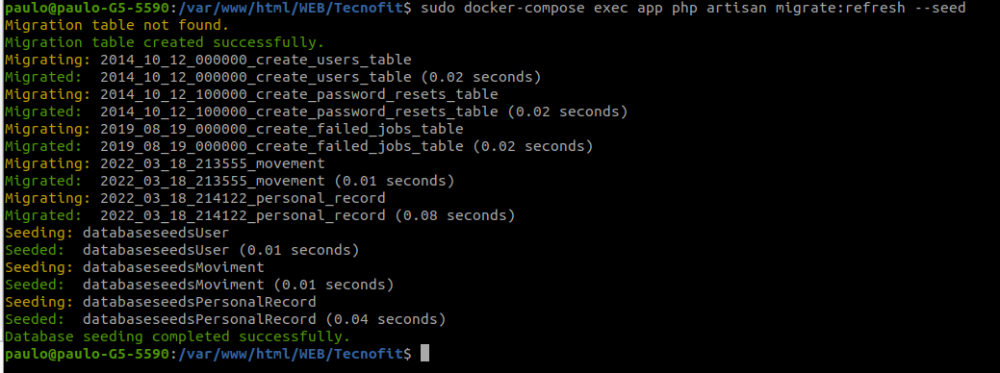
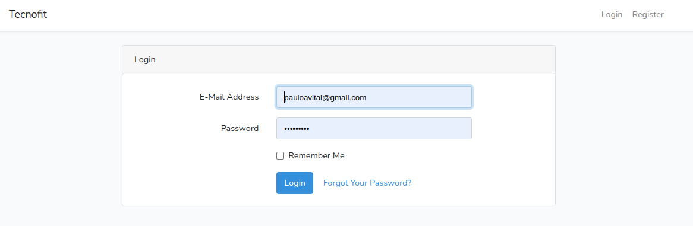
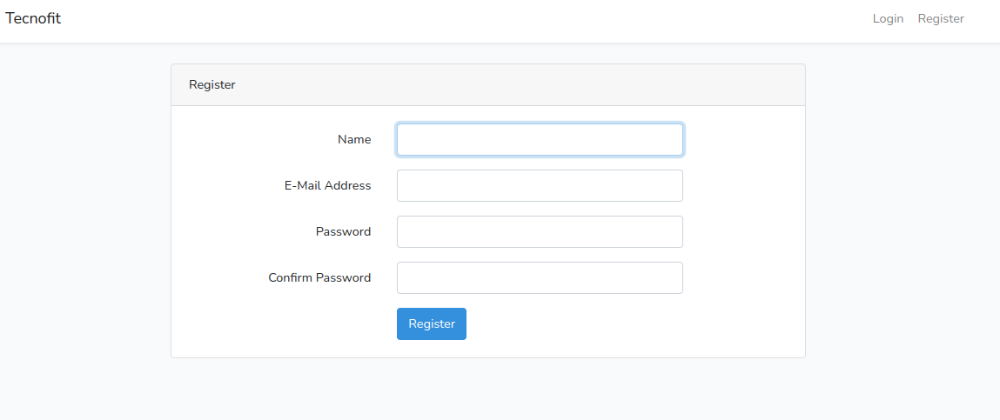
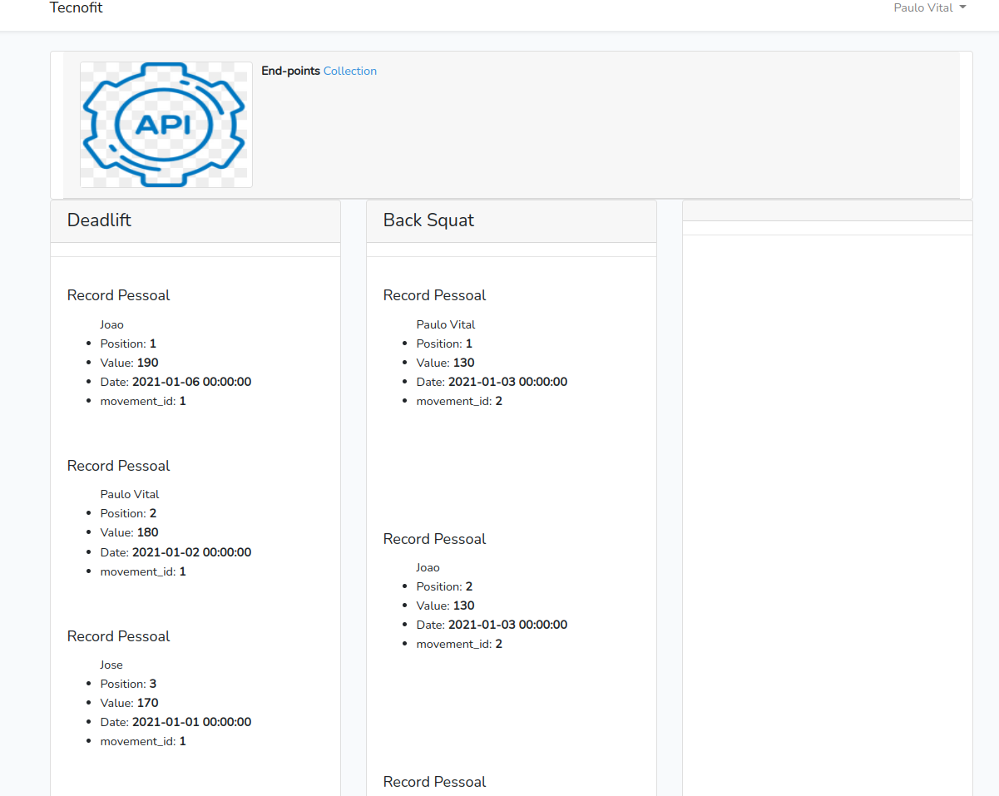

# Teste-Desenvolvimento-Tecnofit

---
## Subindo o Docker para rodar o app

1. **sudo docker-compose build app**

2. **sudo docker-compose up -d**

3. 

---
## Instalar as dependências do composer

4. **sudo docker-compose exec app composer install**

5. 

6. **sudo docker-compose exec app composer update**

6.1 Caso gere algum problema verifique se o **.env** está no projeto

---

## crie uma chave para o artisan

7. **sudo docker-compose exec app php artisan key:generate**

8. 
---

## Verifique se todos containers do Docker subiu

9. **sudo docker ps**

---

10. Rode o Migrate **sudo docker-compose exec app php artisan migrate:refresh --seed**

---

11. Acesse o **_http://localhost:8000/_**

---

12. Realize o login com o usuario ja criado:

    E-Mail Address: pauloavital@gmail.com

    Password: 123456789

13. 

14. Crie seu usuario e realize o login 

---

15. Gostaria de informar que fiz um pouco mais do que o EndPoint Rest solicitado, visando assim mostrar meus conhecimentos.
    Ao entrar no sistema vc poderá ver junto a tela de abertura um link com as collections que foran criadas para o EndPoint Rest, assim como uma demostração visual do conteúdo da API.

    Visto que a task pedia para ir para produção, eu tomei a liberdade de criar o cadastro de usuario vinculado ao sistema podendo tbem ser utilizado nas Api's os verbos ( GET, POST, PUT, DELETE )
    Api's: Movement, User, Personal_Record.

    Ao rodar o migrate todo o conteúdo disponivel no test ja está vinculado ao sistema.

    Qualquer dúvida estou a disposição.